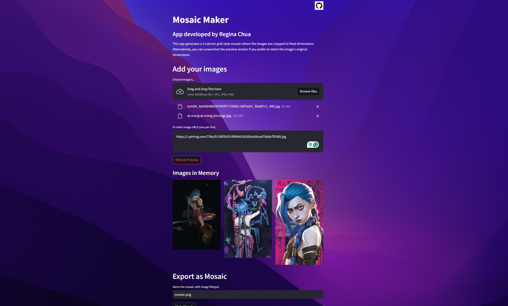

# MOSAIC MAKER
#### Video Demo:
#### Description:

Mosaic Maker is streamlit application I designed to quickly collage images in a 3-column grid to use as a reference. This can apply to vision boards, art reference sheets, palette combinations, mood boards, meme grids (e.g., favorite anime 3x3) and more.

In my case as a digital artist, I wanted 
Here is sample mosaic output for a Jinx & Isha reference:

Then here is my art derived from this reference:

Functions:
- Add images by local file upload and/or URL
- Customize filename (optional)
- Refresh preview of images
- Collage the images into a 3-column mosaic
- Download the mosaic as an image with the customized filename

Created to complete https://cs50.harvard.edu/python/2022/project/